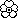
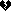
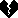
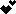
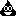

# Rebble Emojis

This contains [emoji](https://en.wikipedia.org/wiki/Emoji) [bitmaps](https://en.wikipedia.org/wiki/Bitmap) created by members of the [Rebble](https://rebble.io/) community. These will be used in [RebbleOS](https://github.com/pebble-dev/RebbleOS) or potentially a language pack for PebbleOS.

Emoji files are in the `emojis` directory. All other files are to do with the auto-generating README file.

## Contributing

Before contributing please consider viewing the [emoji thread](https://discord.com/channels/221364737269694464/902868168660353046) in the \#firmware channel on the [Rebble Discord server](https://rebble.io/discord).

Follow these steps to contribute:

1. Fork this repository
1. Add emojis following the filename convention listed below
1. Open a pull request

## Filename Convention

Each emoji has a small version (roughly 11x11px) and a large version (roughly 18x18px) and should be in `PNG` format.

Typically the background is white and the emoji is black. The black should touch each side so there's no entirely blank column or row along all the outside edges.

The image filename should follow the format '`codepoint`-`sizecode`.png'

The sizecodes are `sm` for small and `lg` for large.

For example, the [star emoji](https://emojipedia.org/star) file in large would be called `2B50-lg.png`.

## Current Emojis

| Emoji | Small | Large |
|:-----:|:-----:|:-----:|
| 🌙 |  |  |
| 🌟 |  |  |
| 🌷 |  |  |
| 🌸 |  |  |
| 🌺 |  |  |
| 🍀 |  |  |
| 🍺 |  |  |
| 🎁 |  |  |
| 🎶 |  |  |
| 🏳 |  |  |
| 👀 |  |  |
| 💀 |  |  |
| 💓 |  |  |
| 💔 |  |  |
| 💕 |  |  |
| 💖 |  |  |
| 💗 |  |  |
| 💘 |  |  |
| 💙 |  |  |
| 💚 |  |  |
| 💛 |  |  |
| 💜 |  |  |
| 💝 |  |  |
| 💞 |  |  |
| 💟 |  |  |
| 💡 |  |  |
| 💣 |  |  |
| 💥 |  |  |
| 💩 |  |  |
| 💯 |  |  |
| 📷 |  |  |
| 🔥 |  |  |
| 🖤 |  |  |
| 🙃 |  |  |
| 🙄 |  |  |
| 🙏 |  |  |
| 🤗 |  |  |
| 🤘 |  |  |
| 🤝 |  |  |
| 🤣 |  |  |
| 🤤 |  |  |
| 🤩 |  |  |
| 🤪 |  |  |
| 🤬 |  |  |
| 🤮 |  |  |
| 🥰 |  |  |
| 🥺 |  |  |
| ™ |  |  |
| ⌚ |  |  |
| ☠ |  |  |
| ⚧ |  |  |
| ✅ |  |  |
| ✨ |  |  |
| ❎ |  |  |
| ❗ |  |  |
| ❣ |  |  |
| ❤ |  |  |
| ⭐ |  |  |
| © |  |  |
| ® |  |  |

> Readme autogenerated @ Sun Nov 20 20:54:39 UTC 2022

