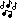
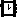
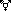
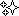
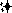

# Rebble Emojis

This repo contains emoji bitmaps created by members of the Rebble community

These will be used in RebbleOS, or potentially a language pack for PebbleOS.

Emoji files are in emojis/

All other folders are to do with the auto-generating readme file.

# Contributing

To contribute create a small and large png file with the emoji, with a filename that follows the convention detailed below.    

Before you open a PR, consider viewing the emoji's thread in \#mobile-apps on the [Rebble discord server](https://rebble.io/discord).   

Each emoji has a small version (roughly 11x11px) and a large version (rougly 18x18px) and should be in png format.   

The image filename should follow the format 'pebble-emoji-`Emoji Name`-`sizecode`-`dimensions`.png'   

sizecode is `sm` for small, `lg` for large.   
For example the large star emoji file with a size of 18x18px would be called `pebble-emoji-star-lg-18x18.png`

# Current Emojis

 - 1f31f-lg.png
   
 - 1f31f-sm.png
   
 - 1f340-lg.png
   
 - 1f340-sm.png
   
 - 1f3b6-lg.png
   
 - 1f3b6-sm.png
   
 - 1f3f3-lg.png
   
 - 1f3f3-sm.png
   
 - 1f4a5-lg.png
   
 - 1f4a5-sm.png
   
 - 1f4af-lg.png
   
 - 1f4af-sm.png
   
 - 1f525-lg.png
   
 - 1f525-sm.png
   
 - 1f643-lg.png
   
 - 1f643-sm.png
   
 - 1f644-lg.png
   
 - 1f644-sm.png
   
 - 1f917-lg.png
   
 - 1f917-sm.png
   
 - 1f918-lg.png
   
 - 1f918-sm.png
   
 - 1f91d-lg.png
   
 - 1f91d-sm.png
   
 - 1f923-lg.png
   
 - 1f923-sm.png
   
 - 1f924-lg.png
   
 - 1f924-sm.png
   
 - 1f929-lg.png
   
 - 1f929-sm.png
   
 - 1f92a-lg.png
   
 - 1f92a-sm.png
   
 - 1f92c-lg.png
   
 - 1f92c-sm.png
   
 - 1f970-lg.png
   
 - 1f970-sm.png
   
 - 1f97a-lg.png
   
 - 1f97a-sm.png
   
 - 231a-lg.png
   
 - 231a-sm.png
   
 - 26a7-lg.png
   
 - 26a7-sm.png
   
 - 2705-lg.png
   
 - 2705-sm.png
   
 - 2728-lg.png
   
 - 2728-sm.png
   
 - 274e-lg.png
   
 - 274e-sm.png
   
 - 2757-lg.png
   
 - 2757-sm.png
   
 - 2763-lg.png
   
 - 2763-sm.png
   
 - 2b50-lg.png
   
 - 2b50-sm.png
   
   

Readme autogenerated @ Sat Nov 20 13:45:11 UTC 2021
