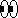

# Rebble Emojis

This contains [emoji](https://en.wikipedia.org/wiki/Emoji) [bitmaps](https://en.wikipedia.org/wiki/Bitmap) created by members of the [Rebble](https://rebble.io/) community. These will be used in [RebbleOS](https://github.com/pebble-dev/RebbleOS) or potentially a language pack for PebbleOS.

Emoji files are in the `emojis` directory. All other files are to do with the auto-generating README file.

## Contributing

Before contributing please consider viewing the [emoji thread](https://discord.com/channels/221364737269694464/902868168660353046) in the \#firmware channel on the [Rebble Discord server](https://rebble.io/discord).

Follow these steps to contribute:

1. Fork this repository
1. Add emojis following the filename convention listed below
1. Open a pull request

## Filename Convention

Each emoji has a small version (roughly 11x11px) and a large version (roughly 18x18px) and should be in `PNG` format.

The image filename should follow the format '`codepoint`-`sizecode`.png'

The sizecodes are `sm` for small and `lg` for large.

For example, the [star emoji](https://emojipedia.org/star) file in large would be called `2B50-lg.png`.

## Current Emojis

| Emoji | Filename |
|:-----:|----------|
|  | `1F440-lg.png` |
|  | `1F440-sm.png` |
|  | `1F480-lg.png` |
|  | `1F480-sm.png` |
|  | `1f31f-lg.png` |
|  | `1f31f-sm.png` |
|  | `1f340-lg.png` |
|  | `1f340-sm.png` |
|  | `1f3b6-lg.png` |
|  | `1f3b6-sm.png` |
|  | `1f3f3-lg.png` |
|  | `1f3f3-sm.png` |
|  | `1f4a5-lg.png` |
|  | `1f4a5-sm.png` |
|  | `1f4af-lg.png` |
|  | `1f4af-sm.png` |
|  | `1f525-lg.png` |
|  | `1f525-sm.png` |
|  | `1f643-lg.png` |
|  | `1f643-sm.png` |
|  | `1f644-lg.png` |
|  | `1f644-sm.png` |
|  | `1f917-lg.png` |
|  | `1f917-sm.png` |
|  | `1f918-lg.png` |
|  | `1f918-sm.png` |
|  | `1f91d-lg.png` |
|  | `1f91d-sm.png` |
|  | `1f923-lg.png` |
|  | `1f923-sm.png` |
|  | `1f924-lg.png` |
|  | `1f924-sm.png` |
|  | `1f929-lg.png` |
|  | `1f929-sm.png` |
|  | `1f92a-lg.png` |
|  | `1f92a-sm.png` |
|  | `1f92c-lg.png` |
|  | `1f92c-sm.png` |
|  | `1f970-lg.png` |
|  | `1f970-sm.png` |
|  | `1f97a-lg.png` |
|  | `1f97a-sm.png` |
|  | `231a-lg.png` |
|  | `231a-sm.png` |
|  | `2620-lg.png` |
|  | `2620-sm.png` |
|  | `26a7-lg.png` |
|  | `26a7-sm.png` |
|  | `2705-lg.png` |
|  | `2705-sm.png` |
|  | `2728-lg.png` |
|  | `2728-sm.png` |
|  | `274e-lg.png` |
|  | `274e-sm.png` |
|  | `2757-lg.png` |
|  | `2757-sm.png` |
|  | `2763-lg.png` |
|  | `2763-sm.png` |
|  | `2b50-lg.png` |
|  | `2b50-sm.png` |

> Readme autogenerated @ Tue Nov 30 15:20:54 UTC 2021

